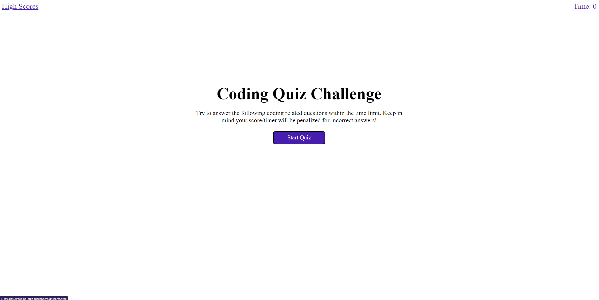
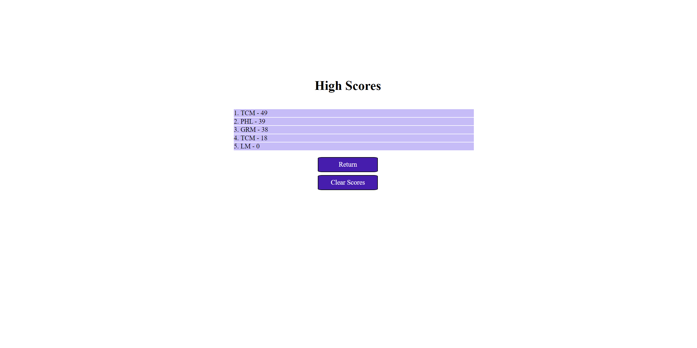

# Coding Quiz Challenge

## Description

Provide a short description explaining the what, why, and how of your project. Use the following questions as a guide:

- What was your motivation?
- Why did you build this project? (Note: the answer is not "Because it was a homework assignment.")
- What problem does it solve?
- What did you learn?

This website provides users with a short quiz to help study aspects of HTML, CSS, and JavaScript. The website has two pages: the main page is where the user can start and take the coding quiz and a second page to display the high scores logged by the user. The second/High Scores page can help the user track their progress in the challenge. The website utizlizes JavaScript and a collection of Web API's (LocalStorage, JSON, and the Document Object Model) to dynamically create and display styled HTML elements and react to user input. This challenge helped me familarize myself with Web API functionality and continue to get comfortable using CSS styling. This is also the first time that I have had a project with multiple script and html files.

## Installation

N/A

## Usage
In order to use this website, open the webpage (https://tcmiller30.github.io/coding-quiz-challenge/) in your browser to launch the homepage.

When the user launches the page, they will be presented with the start screen that provides the rules and a prompt to start the quiz. When the user presses start, the quiz will start and display a question with a set of possible answers below. Once a potential answer is selected by the user, the button's color will change to provide correct/incorrect feedback before moving on to the next question. If a question is answered incorrectly 10 seconds will be subtracted from the time remianing. 

The quiz will end when either the user completes the quiz or the timer ticks down to 0, at which point the game's end screen will appear, display the user's final score, and prompt them to input their initials in a text box. When the initials are submitted, the score is saved to local storage, and the user is sent to another page that displays all the stored scores. These scores are sorted so that the best score is in the first position. The user can return to the main page at any point by pressing the Return button, and stored scores can be cleared with the clear button.

The user can return to the High Scores page at any time by clicking the link anchored in the top left.

Below is a screenshot of what the website looks like at full size.

  

## Credits

MDN Web Docs
  - https://developer.mozilla.org/en-US/docs/Web/JavaScript/Reference/Global_Objects/Array/sort
  - https://developer.mozilla.org/en-US/docs/Web/JavaScript/Reference/Global_Objects/JSON
  - https://developer.mozilla.org/en-US/docs/Web/API/Document

    

## License

MIT License

Copyright (c) [2022] [Travis Miller]

Permission is hereby granted, free of charge, to any person obtaining a copy of this software and associated documentation files (the "Software"), to deal in the Software without restriction, including without limitation the rights to use, copy, modify, merge, publish, distribute, sublicense, and/or sell copies of the Software, and to permit persons to whom the Software is furnished to do so, subject to the following conditions:

The above copyright notice and this permission notice shall be included in all copies or substantial portions of the Software.
THE SOFTWARE IS PROVIDED "AS IS", WITHOUT WARRANTY OF ANY KIND, EXPRESS OR IMPLIED, INCLUDING BUT NOT LIMITED TO THE WARRANTIES OF MERCHANTABILITY, FITNESS FOR A PARTICULAR PURPOSE AND NONINFRINGEMENT. IN NO EVENT SHALL THE AUTHORS OR COPYRIGHT HOLDERS BE LIABLE FOR ANY CLAIM, DAMAGES OR OTHER LIABILITY, WHETHER IN AN ACTION OF CONTRACT, TORT OR OTHERWISE, ARISING FROM, OUT OF OR IN CONNECTION WITH THE SOFTWARE OR THE USE OR OTHER DEALINGS IN THE SOFTWARE.
---# uci-module-3-challenge
This is the weekly challenge for the Week 3 Module on JavaScript
